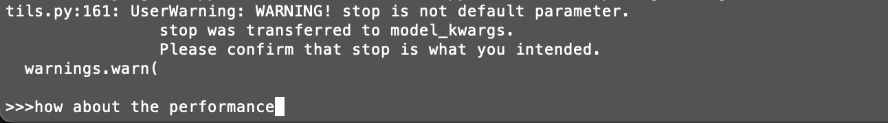
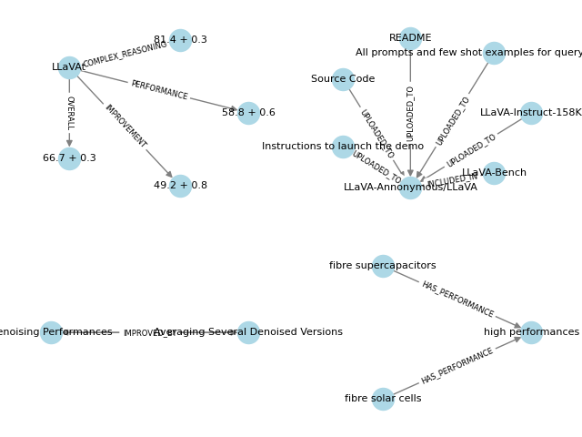

# Graph RAG

## Introduction

 Graph  RAG (Retrieval Augmented Generation) is a technology that uses graph databases to store relationships between data points, replacing traditional text embedding methods like Chuck and enhancing the performance of RAG. This project is base on [Langchain](https://github.com/langchain-ai/langchain/tree/master) and [Neo4j](https://github.com/neo4j/neo4j?tab=readme-ov-file).

> Showcase:
Question is "how about the performance of llava"

Answer is "The performance of LLaVA, as mentioned in the structured data, has an overall score of 66.7 + 0.3, with a complex reasoning score of 81.4 + 0.3, a performance score of 58.8 + 0.6, and an improvement score of 49.2 + 0.8."
The reference is a knowledge graph shown below


## Features

- Create a RAG from PDFs
- Connect to Zotero to retrival PDFs
- Graph visulation through Neo4j Browser
- All data are stored locally, supporting llama.cpp and Ollama local LLM


 ## Usage
 To convert PDF files into graph, just use the dpf2graph.py
 ```
 python pdf2graph.py
 ```
 Enter the path to the PDF file or just enter the title of the paper stored in Zotero library. Each PDF may take several minutes.

 After convert, you can run graphQA.py to query this graph, enter exit to stop.
 ```
 python graphQA.py
 ```

 ## References
 [openai cookbook](https://github.com/openai/openai-cookbook/blob/main/examples/RAG_with_graph_db.ipynb)
 [Langchain](https://github.com/langchain-ai/langchain/tree/master)
 [Neo4j](https://github.com/neo4j/neo4j?tab=readme-ov-file)
 [Pyzotero](https://github.com/urschrei/pyzotero)
 [blogs](https://github.com/tomasonjo/blogs/blob/master/llm/enhancing_rag_with_graph.ipynb?ref=blog.langchain.dev)
